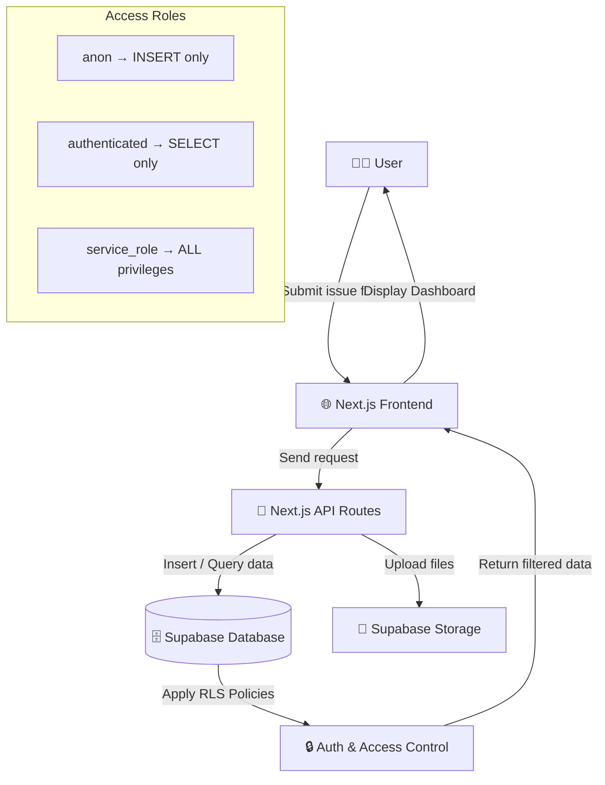

# 🧾Simple Ticket System (IT Support Ticketing)

A simple IT issue reporting system built with **Next.js + Supabase + Tailwind CSS**.  
Users can submit IT support tickets, attach files, and track their progress in real-time through a clean dashboard.

---


---

## 🚀 Features
- 📝 Submit IT issue reports  
- 📂 Upload screenshots or related files (Supabase Storage)  
- 🔐 Role-based Row-Level Security (RLS)  
- ⚙️ Dashboard for support staff (view & update ticket status)  
- 🌐 Multi-language UI (Thai / English)  
- 🌓 Light / Dark mode switch  

---

## 🧠 Tech Stack
| Layer | Technology |
|--------|-------------|
| Frontend | Next.js 14, React 18, Tailwind CSS |
| Backend | Supabase (PostgreSQL, Storage, Auth) |
| Hosting | Vercel |
| Authentication | Supabase Auth (Email/Password) |

---

## ⚙️ Environment Setup

Create a `.env.local` file in the project root with your Supabase credentials:

```bash
NEXT_PUBLIC_SUPABASE_URL=https://hkgxivmowekblwxrn.supabase.co
NEXT_PUBLIC_SUPABASE_ANON_KEY=your_anon_key_here
SUPABASE_SERVICE_ROLE_KEY=your_service_role_key_here
```

> ⚠️ Never commit your real keys to GitHub.  
> For sharing, use `.env.example` with mock data:
```bash
NEXT_PUBLIC_SUPABASE_URL=https://example.supabase.co
NEXT_PUBLIC_SUPABASE_ANON_KEY=example_anon_key
SUPABASE_SERVICE_ROLE_KEY=example_service_key
```

---

## 💻 Run the Project
```bash
pnpm install
pnpm dev
```
Then open [http://localhost:3000](http://localhost:3000)

---

## 🧩 System Architecture


---

### 🔄 System Flow
1. A user opens the website and fills out the issue submission form.  
2. The **Next.js frontend** sends the data via **API Routes** to **Supabase**.  
3. **Supabase Database** stores the ticket data, while attached files are saved to **Supabase Storage**.  
4. **RLS policies** control visibility and access based on user roles.  
5. The **Dashboard** displays all tickets and allows support staff to change their status.

---

## 🔐 Access Control (RLS Policy)
| Role | Permission | Purpose |
|------|-------------|----------|
| **anon** | `INSERT` | Used by public users for submitting tickets |
| **authenticated** | `SELECT` | Used by logged-in support staff to view tickets |
| **service_role** | `ALL` | Used by server-side APIs (admin operations) |

---

## 🖼️ Screenshots

| 🧾 Ticket Form | 📊 Dashboard |
|----------------|--------------|
|  |  |

## 🌍 Live Demo  - COMING SOON
> *(Optional — uncomment when deployed)*  
> [https://simple-ticket.vercel.app](#)

---

## 📜 License
MIT License © 2025  
Developed by [**Wanich Chawweing**](https://github.com/wanit526)

📧 **Email:** wanich.chawweing@gmail.com 
🌐 **Portfolio:** [https://github.com/wanit526](https://github.com/wanit526)

---
